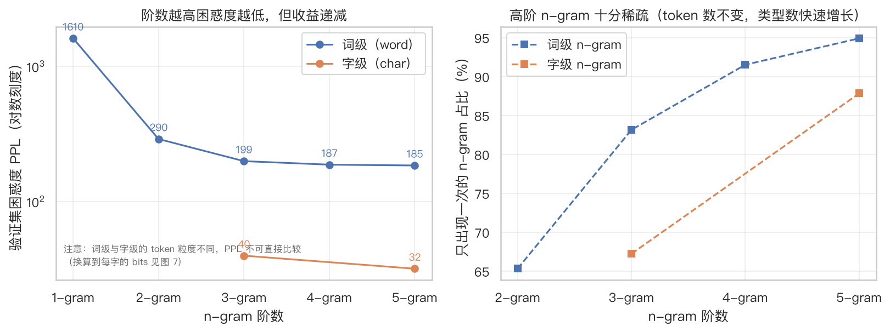
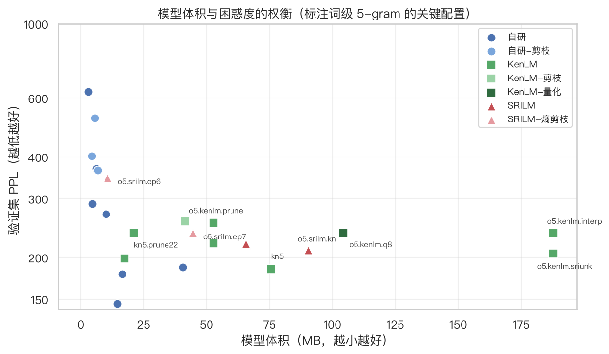
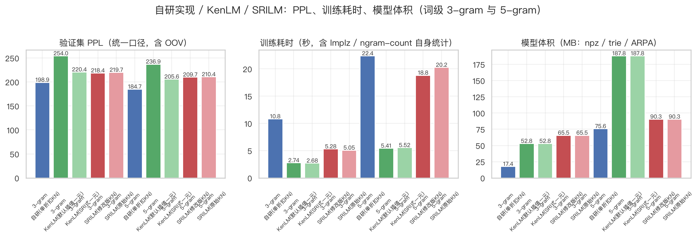
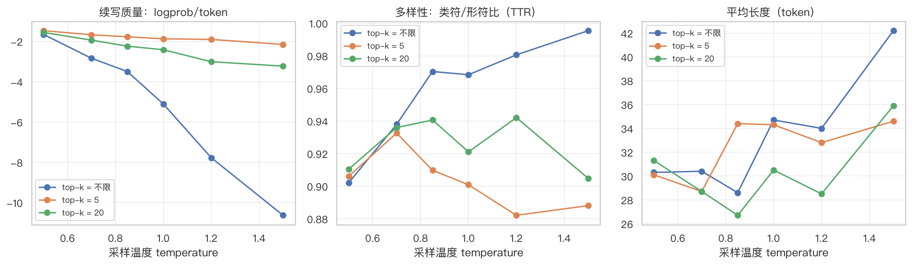

# n-gram-LM

仓库：[Highsun/n-gram-LM](https://github.com/Highsun/n-gram-LM)。Git 仓库根目录对应本地项目的 `code/`；项目根目录的 `实验报告.md` 独立维护，不纳入仓库。

纯 Python + numpy 实现的 n-gram 语言模型工具包：语料清洗 → n-gram 计数 → 平滑 → 困惑度评测 → 文本续写，准备语料后可运行完整流程，不需要编译任何 C/C++ 扩展。仓库里同时附带了 SRILM / KenLM 的训练脚本，方便和其他工具链对比。

默认面向中文，词级（按词建模）和字级都支持，n-gram 阶数 1~8。

```text
corpus/word.train.txt ──┐
                        ├─► train_ngram.py ─► models/*.npz ─► generate.py（续写 / 打分）
clean_corpus.py ────────┘
```

## 特性

- **零编译依赖**：只需要 Python 3 + numpy，没有 C++ 扩展、没有外部工具链。
- **紧凑的计数结构**：词 id 用 16 bit 打包，一条 n-gram 压成 `ceil(n/4)` 个 `uint64`；排序后的键天然按词典序排列，"给定上下文枚举后继词"就是一次 `searchsorted` 区间查询。
- **两种平滑**：插值 Kneser-Ney（默认）与 Stupid Backoff（[Brants et al., 2007](https://aclanthology.org/D07-1090/)，常数回退）。
- **可调模型规模**：分阶频次剪枝、词表裁剪、语料抽样。
- **评测与生成**：困惑度 / OOV 率；采样（temperature、top-k）、贪心、beam 三种解码。
- **中文前缀免分词**：用模型词表做前向最大匹配，直接喂一句中文即可续写。
- **标注语料清洗器**：一并提供 PKU 风格（词 + 词性 + 命名实体方括号）语料的清洗脚本，输出训练器直接可用的纯文本。
- **正确性自检**：`selftest_ngram_lm.py` 用朴素参考实现逐项对齐概率与计数。

## 环境要求

- Python ≥ 3.10
- numpy（运行模型必需）
- matplotlib（只画图时需要，示例环境里是 3.11.2）

```bash
python -m pip install -r requirements.txt
# 或者使用已有的 conda 环境，例如 conda activate ai
```

可选的对比工具（不装也能用，只影响 `run_srilm.sh` / `run_kenlm.sh`）：

- [SRILM](https://www.speech.sri.com/projects/srilm/)：平滑 / 插值 / 剪枝最全的经典学术工具包
- [KenLM](https://github.com/kpu/kenlm)：trie / probing 压缩结构，低延迟低内存

本实验使用的两个工具安装在**单个自包含目录** `~/ngram-toolchain/` 里（独立的 conda 前缀环境 + conda 包缓存也指到该目录内，不动 `base`/`ai` 等现有环境，也不碰 Homebrew）。安装步骤、目录结构和一条命令级的卸载方法见 [TOOLCHAIN.md](TOOLCHAIN.md)：

```bash
SRILM="$HOME/ngram-toolchain/src/srilm" bash run_srilm.sh
KENLM="$HOME/ngram-toolchain/src/kenlm" bash run_kenlm.sh
```

## 数据格式

训练器读取的语料是**每行一句、词之间用空格分隔**的纯文本：

```text
迈向 充满 希望 的 新 世纪 —— 一九九八年 新年 讲话 （ 附 图片 1 张 ）
全区 13 个 县 市 中 有 9 个 是 贫困县 ， 其中 国家 重点 扶持 的 贫困县 有 7 个 。
```

清洗器默认读取 `data/` 下的 `*.txt`。这个目录**不纳入版本控制**（示例语料为 1998 年《人民日报》分词 + 词性标注语料，PKU 标注体系，约 68 MB），请自行放到 `data/` 下，或把 `--input-dir` 指向自己的标注语料。原始标注长这样：

```text
19980101-01-001-004/m  １２月/t  ３１日/t  ，/w  [中央/n  人民/n  广播/vn  电台/n]nt  ...
└── 句子编号 ──┘  └ 词/词性 ┘      └──── 命名实体方括号 ────┘
```

`clean_corpus.py` 会去掉句子编号、词性标签、命名实体方括号与少量脏标注（如 `近年来/l/%`），只对全角数字 / 字母做 NFKC 归一（`１２月 → 12月`，中文标点保留），再按 `。！？…` 切句、按文章粒度划分训练 / 验证集，输出词级与字级两份语料：

为什么要清理这些标注？因为语言模型估计的是 `P(词|上文)`，而标注是元数据：它们会把同一词的不同词性变成不同 token（`希望/n`、`希望/v`…），让词型数从 141,990 涨到 164,533（连同句子编号与方括号是 295,610），并且**会泄漏到生成结果里**——保留标签重训的模型，续写出的 25 个 token 100% 带词性标注（`… 召开 了 的/u 《/w 关于/p …`）。 `python tag_ablation.py` 会重跑这个对照实验，产物见 `results/tag_ablation.md`。

```bash
python clean_corpus.py --input-dir data --out-dir corpus --unit both --dev-ratio 0.02

# corpus/word.train.txt  corpus/word.dev.txt  corpus/word.all.txt
# corpus/char.train.txt  corpus/char.dev.txt  corpus/char.all.txt
# corpus/stats.json      # 行数、token 数、词表规模、标签统计、清洗前后对照示例
```

## 快速开始

```bash
# 0) 准备语料（见上一节）
python clean_corpus.py --input-dir data --out-dir corpus

# 1) 训练：词级 5-gram + 插值 Kneser-Ney
python train_ngram.py --train corpus/word.train.txt --dev corpus/word.dev.txt \
    --order 5 --smoothing kn --out models/word.kn5.npz

# 2) 续写：给一句中文前缀，模型自动分词后续写 40 个词
python generate.py --model models/word.kn5.npz \
    --prefix "在阳光明媚的五月，我们学校胜利召开了" --max-words 40

# 3) 换采样参数、看候选词
python generate.py --model models/word.kn5.npz \
    --prefix "在阳光明媚的五月，我们学校胜利召开了" --temperature 0.7 --top-k 5 --seed 7
python generate.py --model models/word.kn5.npz \
    --prefix "在阳光明媚的五月，我们学校胜利召开了" --show-top 10
```

输出示例（5-gram + KN，`--temperature 0.7 --top-k 5`）：

```text
在阳光明媚的五月，我们学校胜利召开了一系列活动，就像是一座小城，在全国各地的客商云集，
每天都有许多人，也是一个重要的原因，在全国范围内，对此，我想，如果不
```

## 命令行参考

### clean_corpus.py — 标注语料 → 纯文本

| 参数 | 默认 | 说明 |
|---|---|---|
| `--input-dir` / `--out-dir` | `data` / `corpus` | 输入目录（`*.txt`）/ 输出目录 |
| `--unit` | `both` | `word`（词级）、`char`（字级）、`both` |
| `--normalize` | `nfkc-alnum` | `nfkc-alnum` 只折全角数字字母；`nfkc` 全量；`none` 不归一 |
| `--punctuation` | `keep` | `keep` / `drop`（删所有标点）/ `sentence-end-only` |
| `--split-sentences` / `--no-split-sentences` | 开 | 是否按句末标点切句 |
| `--max-sent-len` / `--min-sent-len` | `0` / `1` | 句长上下限（0 表示不截断） |
| `--dev-ratio` / `--seed` | `0.02` / `1998` | 验证集比例（按文章切分）与随机种子 |

### train_ngram.py — 训练

| 参数 | 默认 | 说明 |
|---|---|---|
| `--train` / `--dev` | 必填 / 空 | 训练语料 / 验证语料 |
| `--out` | 空 | 模型输出路径（`.npz`，同时写同名 `.json` 元信息） |
| `--order` | `3` | n-gram 阶数（1~8） |
| `--smoothing` | `kn` | `kn`（插值 Kneser-Ney）或 `sb`（Stupid Backoff） |
| `--alpha` | `0.4` | Stupid Backoff 回退系数 |
| `--min-count` | `1` | 3 阶及以上 n-gram 的最小保留计数（简写） |
| `--prune` | 空 | 分阶剪枝，如 `"1 1 2 2"` 表示 2/3/4/5 阶的最小计数 |
| `--max-types` / `--min-word-count` | `65533` / `1` | 词表上限与最小词频（超出部分映射为 `<unk>`） |
| `--limit-lines` | `0` | 只用训练集前 N 句（0 表示全部） |
| `--ppl-limit` / `--no-ppl` | `200000` / 关 | 困惑度评测的 token 上限 / 跳过评测 |

### generate.py — 续写 / 打分

| 参数 | 默认 | 说明 |
|---|---|---|
| `--model` | 必填 | `train_ngram.py` 产出的 `.npz` |
| `--prefix` / `--prefix-tokens` | 空 | 中文前缀（自动分词）/ 已分好词的前缀 |
| `--max-words` / `--min-words` | `40` / `10` | 最多 / 最少续写 token 数（`min-words` 之前不生成 `</s>`） |
| `--mode` | `sample` | `sample` / `greedy` / `beam` |
| `--temperature` / `--top-k` / `--seed` | `1.0` / `0` / `42` | 采样温度、候选截断、随机种子 |
| `--beam` | `5` | beam 宽度（`--mode beam`） |
| `--show-top` | `0` | 只打印前缀后概率最高的 N 个候选词 |
| `--join` | `none` | 输出拼接方式：`none` 中文连写 / `space` 保留空格 |

生成时默认禁止输出 `<unk>` 与 `<s>`；温度越低、top-k 越小，句子越通顺但越保守（越容易复现语料里的高频搭配）。

### run_experiments.py — 批量实验（一键复现）

```bash
python run_experiments.py --stage all          # 训练矩阵 + 生成矩阵
python run_experiments.py --stage train --only kn3 --force
```

结果写到 `results/`：`training_time.md`（训练时间 / 规模 / 困惑度汇总）、`generation_samples.md`（不同参数的续写对照）、`train_runs.jsonl` / `generation_runs.jsonl`（原始记录）以及 `logs/*.log`（每次训练的分阶段日志）。

### selftest_ngram_lm.py — 正确性自检

```bash
python selftest_ngram_lm.py
```

在一个小人造语料上，把实现与"字典 + 元组"的朴素参考实现逐项对比：n-gram 计数、KN/SB 概率（误差约 1e-17）、困惑度、逐阶归一化 `Σ_w P_k(w|h) = 1`、混合分布总质量 = 1。

### check_env.sh / run_srilm.sh / run_kenlm.sh

```bash
bash check_env.sh              # 记录 python/numpy 版本、工具可用性、语料规模
bash run_srilm.sh --dry-run    # 只打印命令；装好 SRILM 后去掉 --dry-run
bash run_kenlm.sh --dry-run    # 只打印命令；装好 KenLM 后去掉 --dry-run
```

两个脚本覆盖对应工具的标准流程：SRILM 的 `ngram-count -kndiscount/-wbdiscount/-addsmooth`、 `-gtmin/-prune`、`ngram -ppl/-gen`；KenLM 的 `lmplz -o N -S 4G --prune ...`、 `build_binary trie/probing`、`query -v summary`。未安装对应工具时脚本给出提示并非零退出， `--dry-run` 则只打印将要执行的命令。

## Python API

```python
import numpy as np
import ngram_lm as N

# 训练（也可以直接用 train_ngram.py 的 CLI）
lm, stats = N.train(train_path="corpus/word.train.txt", order=3, smoothing="kn", verbose=True)
print(stats["timing"], stats["ngram_types"])

# 保存 / 加载
lm.save("models/word.kn3.npz", stats)
lm, meta = N.NgramLM.load("models/word.kn3.npz")

# 困惑度
word2id = {w: i for i, w in enumerate(lm.vocab)}
dev = N.encode_file("corpus/word.dev.txt", word2id)
print(lm.perplexity(dev))            # {'ppl': ..., 'oov_rate': ..., 'tokens': ...}

# 续写
rng = np.random.default_rng(0)
prefix = [word2id[w] for w in ["在", "阳光", "明媚", "的", "五月", "，"]]
ids = lm.generate(prefix, 20, rng, temperature=0.7, top_k=5)
print("".join(lm.vocab[i] for i in ids))

# 单个词的条件对数概率
print(lm.logprob(word2id["。"], prefix[-2:]))
```

模型文件是压缩的 `.npz`：词表、各阶排序键与计数、一元计数；同名 `.json` 保存训练统计（阶数、平滑方式、各阶类型数、耗时、验证集困惑度等），便于事后查阅。

## 项目结构

```text
.
├── requirements.txt      # Python 依赖（numpy、matplotlib）
├── clean_corpus.py        # 标注语料 → 纯文本（去编号/词性/方括号、切句、切分 train/dev）
├── ngram_lm.py            # 核心库：计数、KN/SB 平滑、困惑度、生成、模型读写
├── train_ngram.py         # 训练 CLI
├── generate.py            # 续写 / 打分 CLI（含中文前缀最大匹配分词）
├── run_experiments.py     # 批量实验与结果汇总
├── run_all.sh             # 一键跑通全部实验并出图
├── ppl_table.py           # 完整验证集上的困惑度/信息量总表
├── gen_sweep.py           # 生成参数（温度 × top-k）量化扫描
├── plot_results.py        # 把结果画成 11 张图（写入 results/figures/）
├── tag_ablation.py        # 对照实验：保留词性标签的代价（词表膨胀 / 标签预测交叉熵 / 生成泄漏）
├── selftest_ngram_lm.py   # 与朴素参考实现对照的自检
├── check_env.sh           # 环境与语料规模记录
├── compare_toolchains.py  # 自研 / KenLM / SRILM 三方对比（同一语料与验证集）
├── run_srilm.sh           # SRILM 训练 / 评测 / 生成脚本
├── run_kenlm.sh           # KenLM 训练 / 评测 / 查询脚本
├── TOOLCHAIN.md           # SRILM / KenLM 的隔离安装与干净卸载说明
├── EXPERIMENTS.md         # 实验运行手册 + 指标字典 + 图目录
├── data/                  # 原始标注语料（自行放置，已 gitignore）
├── corpus/                # 清洗后的语料（生成物，已 gitignore）
├── models/                # 训练好的模型（生成物，已 gitignore）
└── results/               # 实验结果与训练日志（已提交，便于查阅）
    ├── corpus_stats.json        # 本次实验清洗统计快照
    ├── verification.json        # 整理时的复核记录与语料 SHA-256
    ├── training_time.md          # 自研实现的训练时间 / 规模 / PPL 汇总
    ├── toolchain_comparison.md   # 三方对比表
    ├── srilm_timing.txt / kenlm_timing.txt
    ├── ppl_full.md               # 统一口径的困惑度/信息量总表
    ├── generation_sweep_summary.md  # 温度 × top-k 扫描结果
    ├── figures/                  # 11 张可视化图（PNG）
    ├── generation_samples.md     # 不同参数的续写对照
    └── logs/                     # 每次训练的分阶段日志与第三方工具输出
```

## 文档

| 文档 | 内容 |
|---|---|
| `README.md` | 项目说明、安装方式与用法（本文件） |
| `EXPERIMENTS.md` | 实验运行手册、指标字典（定义、方向、可比性前提）与图目录 |
| 项目根目录的 `实验报告.md` | 本地实验报告，位于 `code/` 外；不纳入版本控制、不上传 GitHub |
| `TOOLCHAIN.md` | SRILM / KenLM 的隔离安装与干净卸载 |
| `reflow_markdown.py` | 把 Markdown 中被硬换行切碎的段落合并为"一段一行"：`python reflow_markdown.py --write *.md`（幂等） |

## 性能参考

示例语料 7.14 M 词 / 281,448 句，验证集为按文章切分的 2%（144,776 词），单进程 CPU 实测（macOS 27，numpy 2.5）。PPL 取完整验证集记录 `results/ppl_full.json`；体积与内存沿用原表的 MB 标签，实际按 MiB 换算：

| 模型 | 训练耗时 | 峰值内存 | 模型大小 | dev PPL |
|---|---|---|---|---|
| 词级 3-gram KN | 11.2 s | 820 MB | 17.4 MB | 198.9 |
| 词级 5-gram KN | 22.5 s | 1379 MB | 75.6 MB | 184.7 |
| 词级 5-gram KN（剪掉 singleton） | 18.2 s | 1.19 GB | 21.1 MB | 236.5 |
| 字级 5-gram KN | 31.1 s | 1485 MB | 67.6 MB | 31.84 |
| 词级 3-gram Stupid Backoff（α=1.0） | 9.3 s | 862 MB | 17.4 MB | 125.5\* |

\* Stupid Backoff 的分数不构成归一化概率分布，其困惑度只适合在 SB 内部横向比较，不能与 KN 对照；困惑度也只在同一词表、同一 OOV 率（本示例 2.4%）下才具有可比性。

更细的分阶段耗时、剪枝 / 词表 / 语料规模对比见 `results/training_time.md`。

### 与 SRILM / KenLM 的实测对比

三个工具在同一份语料（281,448 句 / 7.14 M 词）和同一验证集（150,501 token，含句末）上的实测值，完整表格见 [`results/toolchain_comparison.md`](results/toolchain_comparison.md)：

| 模型 | 自研 numpy | KenLM（修改版 KN） | SRILM（修改版 KN） |
|---|---|---|---|
| 词级 3-gram 训练耗时 | 10.8 s | **2.7 s** | 5.3 s |
| 词级 3-gram 模型体积 | **17.4 MB** | 52.8 MB（trie） | 65.5 MB（ARPA） |
| 词级 3-gram PPL | **198.9** | 254.0（SRI 式一元 220.4） | 218.4 |
| 词级 5-gram 训练耗时 | 22.4 s | **5.4 s** | 18.8 s |
| 词级 5-gram 模型体积 | 75.6 MB | 187.8 MB（trie） | **90.3 MB**（ARPA） |
| 词级 5-gram PPL | **184.7** | 236.9（SRI 式一元 205.6） | 209.7 |
| 5-gram 剪枝后（只剪 singleton） | 21.1 MB / PPL 236.5 | 41.4 MB / PPL 256.7 | 44.6 MB / PPL 236.6（熵剪枝 1e-7） |

**怎么读这张表**：训练耗时三家在同一量级（KenLM 最快，约比自研单进程快 4 倍，而不是一个数量级）；体积上自研用 zlib 压排序整数数组反而最小，KenLM 的 trie 未量化、ARPA 是纯文本； **PPL 不能只按数字比**：自研把词表截到 65,533 并把 3,226 个 dev token 映射成高频 `<unk>`，而 KenLM/SRILM 保留全部 140,460 个词型、OOV 只有 1,992 个且 `<unk>` 概率小得多。把 KenLM 切成 SRI 式一元（`--interpolate_unigrams 0`）后它的 PPL 从 254.0 掉到 220.4，说明一元插值与未知词处理设置会显著影响指标。SRILM 表中数值仅重算分母，没有补回零概率 OOV 的代价，不能称为含 OOV 的统一 PPL。**字级**是更接近的对照：全量语料含 5,683 字型，自研建模词表为 5,679（含特殊符号），验证集 OOV 为 7；记录分别为 KenLM 39.30 / 自研 39.76 / SRILM 40.98，最大相对差约 4.3%，仍存在评测与平滑差异。

KenLM 的 trie 面向压缩查询；现有记录没有统一的三方加载内存与热启动延迟基准，自研训练峰值不能当作查询常驻内存。`build_binary -q 8 -b 8` 8-bit 量化后模型 187.8 → 104.3 MB、PPL 上升约 0.08%。

### 复现实验与可视化

```bash
bash run_all.sh              # 一键跑通：清洗 → 训练矩阵 → 三方对比 → 指标总表 → 参数扫描 → 出图
bash run_all.sh --skip-tools # 没装 SRILM/KenLM 时
```

各部分也可以单独跑：`python ppl_table.py`（完整验证集上的困惑度总表）、 `python gen_sweep.py`（温度 × top-k 的参数扫描）、`python plot_results.py`（出图到 `results/figures/`）。每个指标的**定义、单位、可比性前提**，以及 11 张图分别画了什么、数据来自哪、适合放在报告哪一节，都写在 [EXPERIMENTS.md](EXPERIMENTS.md) 里。






## 已知限制

- 当前清洗对双层后缀 `次/q/m` 只去掉最外层，现有训练集残留 5 个 `次/q`；现有实测结果对应此版本。
- SB 打分采用最高阶命中回退，采样分布却累加各阶项；现有 SB 生成结果不能作为严格按 SB 分数归一化采样的验证。
- 标签对照的切句、归一化与前缀编码未完全对齐；标签预测交叉熵也不等于严格条件熵。详见 [实验运行手册](EXPERIMENTS.md)。

- 单进程、计数表全部驻留内存，没有 trie / 量化压缩，5-gram 就需要 GB 级内存；几十 GB 级模型建议使用 KenLM 这类实现（`run_kenlm.sh` 里有对应命令）。
- 词 id 用 16 bit 打包，所以词表被限制在 65,533 个词型；语料里其余 7 万多个低频词型会被映射成 `<unk>`。这既压低了对生僻词的处理能力，也让困惑度数字"变好看"（`<unk>` 是高频词），跨工具比较 PPL 时必须留意这一点。
- 平滑只实现了插值 KN（单一折扣 `D = n₁/(n₁+2n₂)`）与 Stupid Backoff，没有 Jelinek-Mercer / Witten-Bell / 绝对折扣等 SRILM 里的其他方案。
- 词级生成依赖最大匹配分词，前缀切分可能与语料标注的切分不完全一致。
- 只支持空格分隔的 token 语料，未做 BPE / 子词建模。

## Roadmap

- [ ] Modified Kneser-Ney（按计数分档折扣）与更多平滑方法
- [ ] 读写 ARPA 文件，便于与 SRILM / KenLM 互通
- [ ] 放宽 16-bit id 限制（改用 20/24 bit 字段），支持 10 万级词表
- [ ] 生成阶段加入重复惩罚与长度归一化
- [ ] 计数表落盘 / 分块训练，支持超出内存的语料

## 许可

本项目以 [MIT License](LICENSE) 发布。仓库中的示例语料（`data/`）不纳入版本控制，使用时请自行获取并遵守其原始许可。
